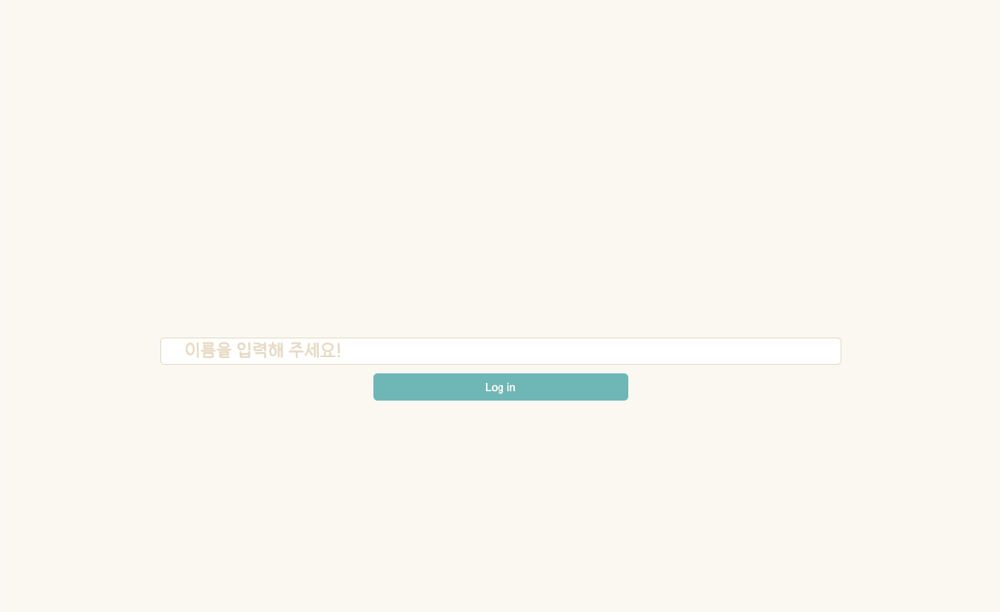
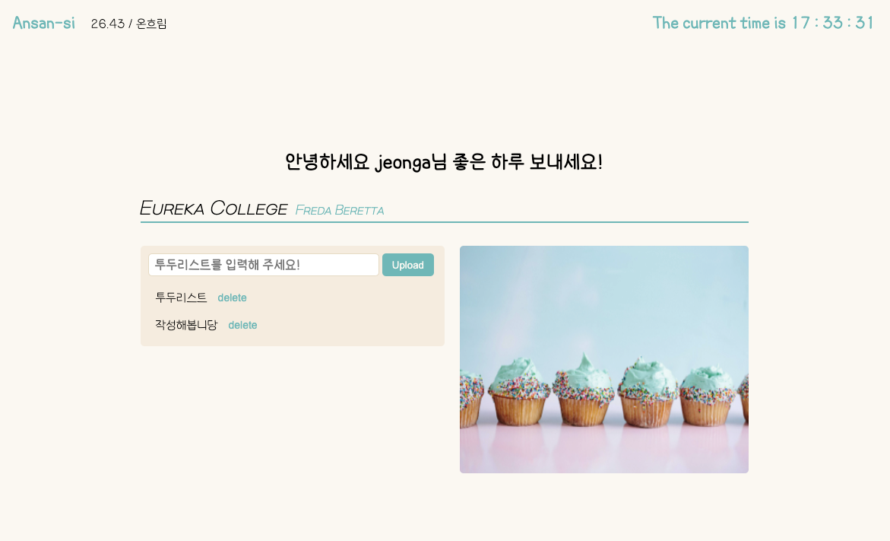
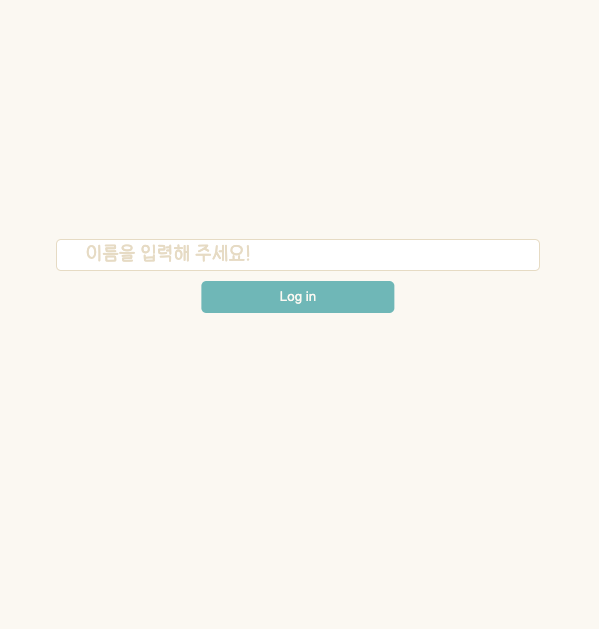
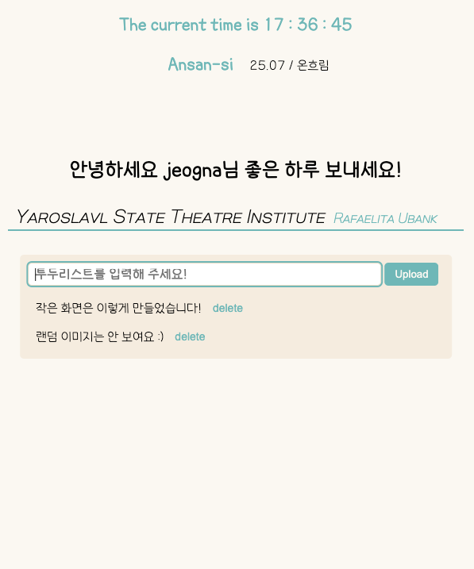

# Todo list

<b>PROJECT 소개</b>

기존 2주 챌린지를 진행하며 스타일을 적용시키지 않은 채로 제출했던 프로젝트를 javascript와 scss 코드를 새로 작성 & 수정하며 진행했습니다.

🗓️ **작업기간** : 2022.04-2022.04

🙋 **참여인원** : 1명

📘 **주요업무 :**

- local Storage를 사용하여 local Storage에 정보가 없을 때 이름 입력 칸이 나오게 설정
- innerText를 사용하여 자동적으로 랜덤 문구가 나오게 설정
- 새로 고침할 때마다 이미지 변경
- 날씨 API를 통해 현재 사용자의 위치를 파악하여 날씨 알림
- local Storage를 이용하여 새로고침해도 todo list 정보 저장 및 삭제
- scss를 이용하여 반응형으로 제작

🌱 **스킬 및 사용툴** : `HTML5` `SCSS` `JAVASCRIPT` `GIT` `VSCODE`

📚 **보완해야 할 점** :

- local Storage의 data를 파악하여 해당하는 DOM을 화면에 표시할 때, data가 제대로 인식되지 않아 reload() 메서드를 사용하였는데 과한 새로고침을 지양하기 위해 새로운 방법 고안
- 자바스크립트의 호이스팅을 사용하여 localStorage를 활용한 Log in기능을 만들었기 때문에 보다 깔끔하게 해결할 수 있는 방법 고안

📝 **프로젝트 진행 후 느낀 점** :

- 강의를 다시 듣고, 프로젝트를 새롭게 진행하다 보니 과거엔 이해하지 못했던 부분에 대한 이해(사용하는 메서드나 함수의 기능들과 코드의 흐름)가 되며 코드를 따라 쓴 느낌이 아닌 코드 진행 순서를 파악하며 작성한 것 같았다. 물론 그럼에도 완벽히 내것을 만들지는 못했으나 시간이 조금 더 지난 후 사용한 동작들을 보완해야 할 점을 보완하여 새로 작성해 보려고 한다.

- createElment를 사용하다 보니 비동기 처리의 필요성 및 중요성을 느끼게 되었다. 아직 비동기처리를 잘 활용하지 못하기 때문에 weatherAPI를 불러올 때 fetch를 사용한 것 외에 사용하지 못한 게 아쉬웠다.

- 수업 때 작성한 코드를 보지 않고 오류가 나거나 기억이 나지 않을 때 구글을 사용해 해결을 했기 때문에 작성 흐름이나 기능에 대해 더 정확히 알게 되었고, 오류 발생 원인에 대해 생각을 많이 하게 된 것 같아 좋았다.

- 미처 끝내지 못했던 챌린지를 완전히 끝낸 것에 대한 성취감이 있었다.

👉 _[포트폴리오 및 깃허브 링크 연결](http://199jeonga.github.io)_

---

✔️ pc - 로그인 화면

✔️ pc - 로그인된 후 사용자 화면

---

✔️ mobile and tablet - 로그인 화면

✔️ mobile and tablet - 로그인된 후 사용자 화면

